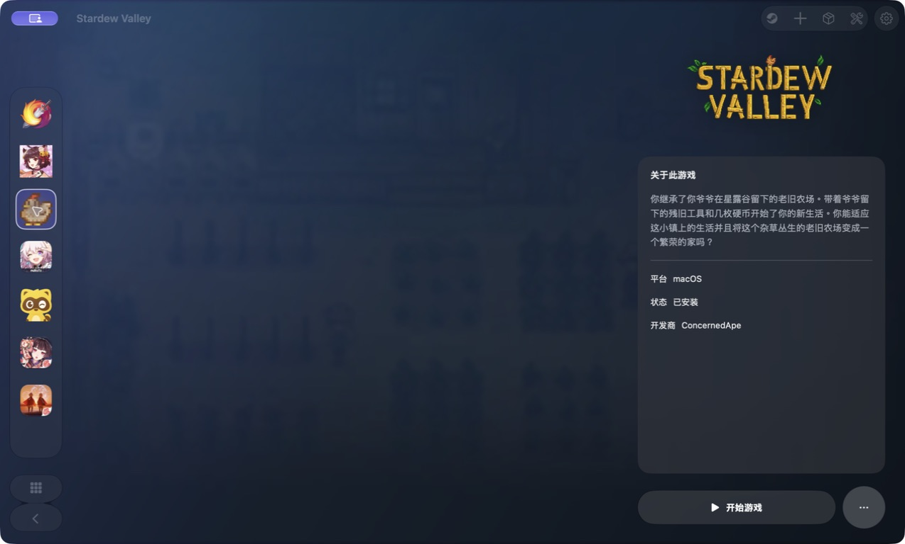
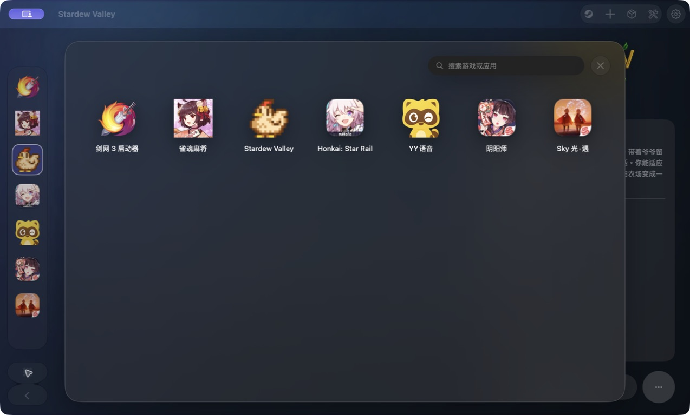

# Arclume

> Arclume 2.0 · 全新 UI 设计，为 Mac 打造的统一游戏启动器。

[简体中文](#简体中文) · [English](#english)



## 简体中文

Arclume 用一个本地游戏库管理 macOS 原生游戏、Steam 原生游戏，以及通过 CrossOver 或 Arclume Wine Runtime 启动的 Windows 游戏。它由 Arclume 社区独立维护，不隶属于 CrossOver、CodeWeavers、Steam 或金山，也不获得其背书。

### 功能

- **宽屏启动器**：游戏背景、标志与资讯，随应用图标取色的玻璃操作按钮。
- **图标侧栏与启动台**：侧栏可收起、拖动排序、悬停查看名称；启动台只显示已安装项目，支持搜索。下次打开会记住上次选择。
- **自动发现游戏**：扫描已安装的原生 App 和 Steam 游戏，支持多个 Steam 库；已有游戏库先显示，后台增量刷新。
- **统一运行环境**：Windows 应用使用 `Application Support/Arclume/ALBottles`；旧版容器通过应用内升级流程迁移。Steam 和剑网3启动器均可选配置。
- **新的设置与项目编辑**：管理运行选项，匹配 Steam、App Store 等来源的名称、简介、背景与标志；优先采用当前应用语言的资料。
- **首次使用引导**：全窗口欢迎页、真实功能区域的箭头指引，以及可选的迁移与初始化流程。
- **独立 Runtime 更新**：D3DMetal 3 / 4、DXVK、msync、Metal HUD；应用和运行环境分别检查更新。



以上为新版程序的实际截图。游戏图片、名称与标志归各自权利人所有，不代表合作或背书。

### YY 兼容性说明

此版本附带 YY 专用 DNS／频道软件渲染适配和 Wine 加载锁顺序补丁。**YY 在麦序模式下可能仍出现交互无响应。** 普通模式单次测试正常不等于所有频道或长期语音会话均稳定；遇到问题请保留现场并提供脱敏日志。

### 系统要求

- macOS 26.0 或更高版本。
- Arclume Wine 无需安装 CrossOver；Steam 也不是使用 Arclume 的前提。
- Arclume Wine Runtime 仅面向 x86_64 Windows 游戏；Apple Silicon Mac 通过 Rosetta 运行其 Wine 进程。

### 安装与更新

Release 提供两种 DMG：

| 文件 | 适用场景 |
| --- | --- |
| `with-runtime` | 首次安装或需要离线初始化 Arclume Wine 的用户。 |
| `no-runtime` | 已安装 Runtime 或希望减小下载体积的用户；可在“设置 → 更新”下载 Runtime。 |

每个 DMG 都附带 SHA-256 文件。应用内更新会下载 Release 的 DMG，校验 SHA-256、Bundle ID 和版本/构建号后覆盖安装并重启；因此未配置 Developer ID 证书的 Actions 产物也可作为更新来源。Developer ID 签名与公证状态以对应 Release 说明为准。

应用替换与 Runtime 更新不覆盖游戏、存档或用户 Prefix。旧版统一容器升级是单独的应用内迁移流程；从 2.0.1 起只检查文件基本信息，不扫描游戏文件内容或执行哈希校验，复制由系统完成。迁移成功后清理旧容器，不保留重复副本；复制失败会中止切换并保留恢复路径。Runtime 更新仍检查 Manifest、ABI 与 SHA-256，并以原子替换方式更新运行时本体。

### 项目结构

| 路径 | 内容 |
| --- | --- |
| `Arclume/` | SwiftUI App、启动器、Bottle、游戏库与资源。 |
| `ArclumeTests/` | 核心逻辑测试，主要使用 Swift Testing。 |
| `ArclumeUITests/`、`ArclumeUITestsLaunchTests.swift` | 需要交互桌面会话的 UI XCTest。 |
| `script/` | 本地构建、Runtime 嵌入和开发辅助脚本。 |
| `CHANGELOG/` | 不可覆盖的变更记录；每个逻辑改动必须新增条目。 |
| `docs/` | 架构、开发、测试、Runtime、发布与审核规范。 |

Wine 的源代码锁定、补丁与独立归档由 `Arclume-Runtime` 项目维护；本仓库通过 Runtime Manifest 固定 ABI、版本、归档名和 SHA-256。详见 [Runtime 文档](docs/runtime.md)。

### 开发

先安装 Git LFS，并取得所有 LFS 资源：

```bash
git lfs install
git lfs pull
```

基础构建：

```bash
xcodebuild \
  -project Arclume.xcodeproj \
  -scheme Arclume \
  -configuration Debug \
  CODE_SIGNING_ALLOWED=NO \
  build
```

贡献前请阅读：

- [贡献指南](CONTRIBUTING.md)
- [Agent 工作约定](AGENTS.md)
- [开发环境](docs/development.md)
- [测试策略与新 XCTest 计划](docs/testing.md)
- [PR 审核规范](docs/pr-review.md)
- [发布流程](docs/release.md)

### 参与共建

Arclume 是独立项目，在本仓库维护和发布。欢迎通过 Issue、讨论和 PR 一起维护启动体验、兼容性、Runtime 集成、文档与测试；所有贡献均按本仓库的 [贡献指南](CONTRIBUTING.md) 和 [行为准则](CODE_OF_CONDUCT.md) 审核。

### 社区与支持

- 功能或兼容性请求：使用 Issue 模板，并附上脱敏后的诊断日志。
- 安全问题：请遵循 [安全策略](SECURITY.md)，不要公开漏洞细节。
- 使用问题与日志隐私：见 [支持说明](SUPPORT.md)。
- 行为规范：见 [行为准则](CODE_OF_CONDUCT.md)。

### 许可证与第三方组件

Arclume 源代码采用 [GNU GPL v3.0 only](LICENSE.txt)。发布二进制时必须提供相应版本的完整源码，并保留现有源文件中的版权、许可证及适用的附加法律声明。

Wine、DXVK、D3DMetal、字体和游戏相关资源拥有各自的许可证与再分发条件；它们不会因 Arclume 使用 GPL 自动改变许可证。D3DMetal 不是 Arclume 开源代码，也不因本仓库公开而改变其 Apple 条款。每个二进制 Release 均在同一 GitHub Release 页面指向对应源码与第三方声明；详见 [第三方声明](THIRD-PARTY-NOTICES.md)。

---

## English

Arclume is an independent, community-driven macOS game launcher. It manages native macOS games, native Steam games, and Windows games launched through CrossOver or the Arclume Wine Runtime. It is independently maintained by the Arclume community and is not affiliated with or endorsed by CrossOver, CodeWeavers, Steam, or Kingsoft.

### Highlights

- A redesigned widescreen launcher, collapsible/reorderable icon sidebar, installed-app launchpad, and remembered selection.
- Automatic discovery of installed native and Steam games, with cached startup and background refresh across multiple Steam libraries.
- A unified ALBottles environment with an in-app legacy migration flow. Steam and JX3 setup are optional.
- Redesigned settings, project editing, localized Steam/App Store metadata matching, artwork, and guided onboarding.
- An independently versioned Arclume Wine Runtime with D3DMetal 3/4, DXVK, msync and Metal HUD.
- Separate application and Runtime update checks, automatic fallback, built-in mirrors, and custom HTTPS update sources.

### Requirements

- macOS 26.0 or later.
- CrossOver is not required to use Arclume Wine; Steam installation is optional.
- The bundled Runtime targets x86_64 Windows software; Wine runs through Rosetta on Apple Silicon Macs.

### Distribution

Each Release contains two DMGs and matching SHA-256 files. Developer ID signing and notarization status are stated in the corresponding Release notes:

- `with-runtime` includes the verified Wine archive for first-run or offline setup.
- `no-runtime` is smaller and is intended for users who already have a Runtime; the Runtime can be downloaded in **Settings → Updates**.

Application updates verify the DMG SHA-256, bundle ID, and version/build before staging, replacing, and restarting; they do not require matching Developer ID signatures. Runtime updates validate their Manifest, ABI and SHA-256, then atomically replace only the runtime files. Legacy container migration is a separate in-app upgrade flow. Starting with 2.0.1, it inventories file metadata without reading or hashing game contents, and delegates copying to the OS. Old containers are removed after successful migration rather than retained as duplicate copies; copy errors stop activation and leave recovery available.

### Known YY limitation

The release includes YY-specific DNS/software-rendering support and a Wine loader-lock ordering fix. **YY may still become unresponsive in microphone-queue mode.** Successful normal-mode testing is not a guarantee for all channels or long-running voice sessions.

### Contributing

Arclume is maintained and released here. Start with [CONTRIBUTING.md](CONTRIBUTING.md), [AGENTS.md](AGENTS.md), and the [documentation index](docs/development.md). Every logical change must add a new immutable entry under [CHANGELOG/](CHANGELOG/README.md).

### License

Arclume source code is licensed under [GPL-3.0-only](LICENSE.txt). Runtime libraries, fonts, and game-related resources retain their own licenses; see [NOTICE.md](NOTICE.md) and [THIRD-PARTY-NOTICES.md](THIRD-PARTY-NOTICES.md).
